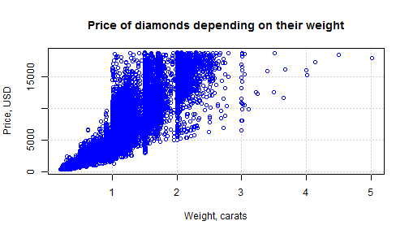

## Diamonds color

There are some things you should consider if you want to choose a diamond. One of them is color. Internationally recognized laboratories (GIA & IGI for example) use a grading scale for diamonds in the normal color range. The scale ranges from D which is totally colorless to Z which is a pale yellow or brown color. Brown diamonds darker than K color are usually described using their letter grade, and a descriptive phrase, for example M Faint Brown. Diamonds with more depth of color than Z color fall into the fancy color diamond range.

You can read more about it [here](https://en.wikipedia.org/wiki/Diamond_color).

The best diamonds have color between D and J.

---

## Diamonds cut

A diamond cut is a style or design guide used when shaping a diamond for polishing such as the brilliant cut. Cut does not refer to shape (pear, oval), but the symmetry, proportioning and polish of a diamond. The cut of a diamond greatly affects a diamond's brilliance; this means if it is cut poorly, it will be less luminous.

You can read more about it [here](https://en.wikipedia.org/wiki/Diamond_cut).

---

## Diamonds clarity

Diamond clarity is the quality of diamonds that relates to the existence and visual appearance of internal characteristics of a diamond called inclusions, and surface defects, called blemishes. Clarity is one of the four Cs of diamond grading, the others being carat, color, and cut.

You can read more about it [here](https://en.wikipedia.org/wiki/Diamond_clarity).

---

## Choose your diamond!

To provide you with the best choice of diamond we use a dataset of 53940 diamonds.

You should only choose desired cut, color, clarity and weight of a diamond, and we'll give you an approximate price you can focus on. Our program uses modern prediction techniques to provide you with the best estimation of the price.

### Try it [here](https://iakimov.shinyapps.io/ChooseYourDiamond/).
